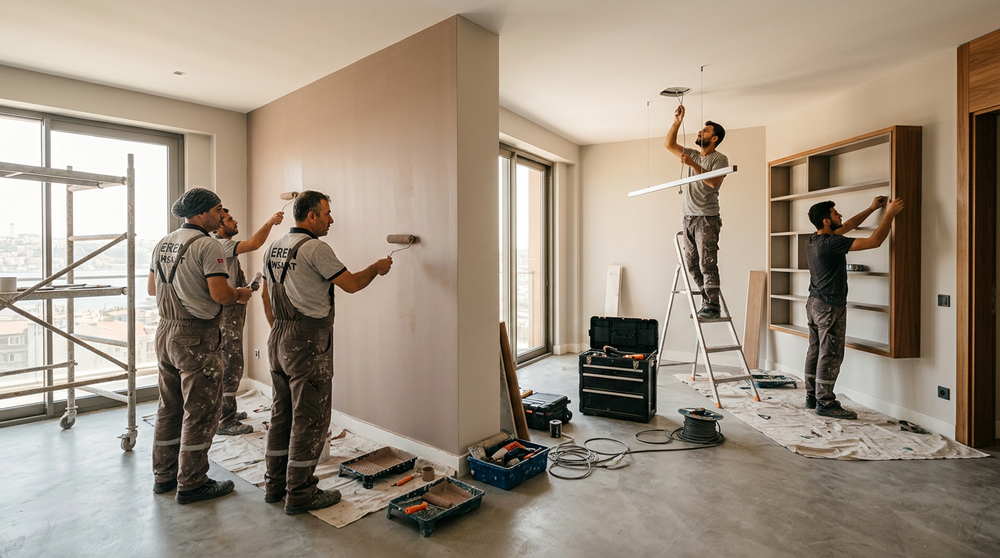

# 🔨 USTABAŞI - Türkiye'nin En Güvenilir Usta Eşleştirme Platformu

[](https://vitejs.dev)
[](https://react.dev)
[](https://www.typescriptlang.org)
[](https://tailwindcss.com)
[](https://supabase.com)
[](https://vercel.com)

> **Usta İşi, Güvenilir Hizmet** - Bulunduğun bölgedeki en iyi ustalara dakikalar içinde ulaş.

---

## ✨ Özellikler

### 🏠 Ana Sayfa
- Premium hero bölümü, canlı istatistikler
- 15+ hizmet kategorisi
- Akıllı usta eşleştirme algoritması

### 👤 Usta Sistemi
- Detaylı usta profilleri (puan, yorumlar, rozetler)
- Canlı durum takibi (Aktif / Meşgul / Çevrimdışı)
- Güvenilirlik rozetleri (Kimlik, Telefon, Adres, Sertifika)
- Konum bazlı mesafe hesaplama

### 📱 USTAGRAM - Sosyal Platform
- Instagram benzeri akış (Story Bar, post kartları)
- Öncesi/Sonrası karşılaştırma (sürüklenebilir slider)
- Beğenme, yorum, kaydetme, paylaşma, takip etme
- Proje galerisi ve detay modalı
- Arama ve gelişmiş filtreleme
- Şirket reklam paneli
- Admin moderasyon paneli

### 🏢 Firma Modülü
- Firma kaydı ve yönetimi
- Çalışan usta listesi ve rolleri
- İş takibi ve durum yönetimi
- Firma-iş-usta ilişkisi

### 🗺️ Dünya Haritası
- Leaflet entegrasyonu
- Usta, firma ve iş pin'leri
- GPS konumuma git
- Filtreleme ve arama
- Lejand (renk açıklamaları)

### 🚨 Acil Durum Sistemi
- 5 kategori: Elektrik, Su, Klima, Doğalgaz, Diğer
- Aciliyet seviyesi: Kritik / Yüksek / Orta
- Otomatik usta atama
- "Ustam Nerede?" canlı takip

### 💬 Mesleki Sohbet Kanalları
- 5 uzmanlık kanalı
- Gerçek zamanlı mesajlaşma
- Meslektaş yardımlaşması

### 🔔 Bildirim Merkezi
- Teklif, iş, mesaj, acil durum bildirimleri
- Okundu/okunmadı takibi

### 📝 Blog & İçerik
- SEO uyumlu blog yazıları
- Kategori ve etiket sistemi

### 🔐 Auth & Güvenlik
- E-posta/şifre girişi
- Google OAuth desteği
- 3 hesap türü: Müşteri, Usta, Firma

### 🌟 Diğer Özellikler
- Dark/Light tema geçişi
- Glassmorphism UI
- Tam responsive tasarlım
- Framer Motion animasyonları
- PWA desteğine hazır

---

## 🚀 Kurulum

```bash
# 1. Repoyu klonla
git clone https://github.com/kullaniciadi/ustabasi.git
cd ustabasi

# 2. Bağımlılıkları yükle
npm install

# 3. Ortam değişkenlerini ayarla
# .env dosyası oluştur:
cp .env.example .env

# 4. Geliştirme sunucusu başlat
npm run dev

# 5. Production build
npm run build
```

---

## 🔧 Ortam Değişkenleri

`.env` dosyasına ekle:

```env
# Supabase
VITE_SUPABASE_URL=https://your-project.supabase.co
VITE_SUPABASE_ANON_KEY=your-anon-key
SUPABASE_SERVICE_ROLE_KEY=your-service-role-key

# Google OAuth (isteğe bağlı)
VITE_GOOGLE_CLIENT_ID=your-google-client-id
VITE_GOOGLE_AUTH_PROXY=https://your-auth-proxy.com
```

---

## 📁 Proje Yapısı

```
ustabasi/
├── api/                    # Vercel Serverless API (25+ endpoint)
│   ├── db-client.js          # Supabase client
│   ├── ustas.js              # Usta CRUD
│   ├── usta_posts.js         # Ustagram gönderileri
│   ├── companies.js          # Firma yönetimi
│   ├── emergency.js          # Acil durum
│   ├── tracking.js           # Canlı konum takibi
│   └── ...                   # Diğer endpoint'ler
├── src/
│   ├── pages/                # 20+ sayfa
│   ├── components/           # Bileşenler
│   ├── contexts/             # Auth & Theme
│   ├── lib/                  # Supabase client
│   ├── App.tsx               # Router
│   └── main.tsx              # Giriş noktası
├── public/                 # Statik dosyalar
├── index.html              # HTML giriş
├── package.json            # Bağımlılıklar
├── vite.config.ts          # Vite yapılandırması
└── vercel.json             # Vercel yapılandırması
```

---

## 📚 Veritabanı Tabloları

| Tablo | Amaç |
|-------|------|
| `categories` | 15+ hizmet kategorisi |
| `ustas` | Usta profilleri |
| `jobs` | İş talepleri |
| `offers` | Teklifler |
| `messages` | Mesajlaşma |
| `reviews` | Değerlendirmeler |
| `blog_posts` | Blog yazıları |
| `usta_posts` | Ustagram gönderileri |
| `post_likes` | Beğeniler |
| `post_comments` | Yorumlar |
| `saved_posts` | Kaydedilenler |
| `followers` | Takip sistemi |
| `reports` | İçerik moderasyonu |
| `featured_posts` | Sponsorlu gönderiler |
| `companies` | Firmalar |
| `company_employees` | Firma-çalışan ilişkisi |
| `company_jobs` | Firma iş takibi |
| `emergency_requests` | Acil durum talepleri |
| `chat_rooms` | Sohbet kanalları |
| `chat_messages` | Sohbet mesajları |
| `tracking` | Canlı konum |
| `notifications` | Bildirimler |

---

## 📱 Ekran Görüntüleri

| Ana Sayfa | Ustagram | Harita |
|-----------|----------|--------|
|  | Ustagram Akışı | Canlı Harita |

---

## 📞 İletişim

- **E-posta:** ustabasi.official@gmail.com
- **Instagram:** [@ustabasi.tr](https://instagram.com/ustabasi.tr)
- **Facebook:** [ustabasi.tr](https://facebook.com/ustabasi.tr)
- **Telefon:** 0850 123 45 67

---

## 📄 Lisans

MIT License - © 2025 Ustabaşı. Tüm hakları saklıdır.
